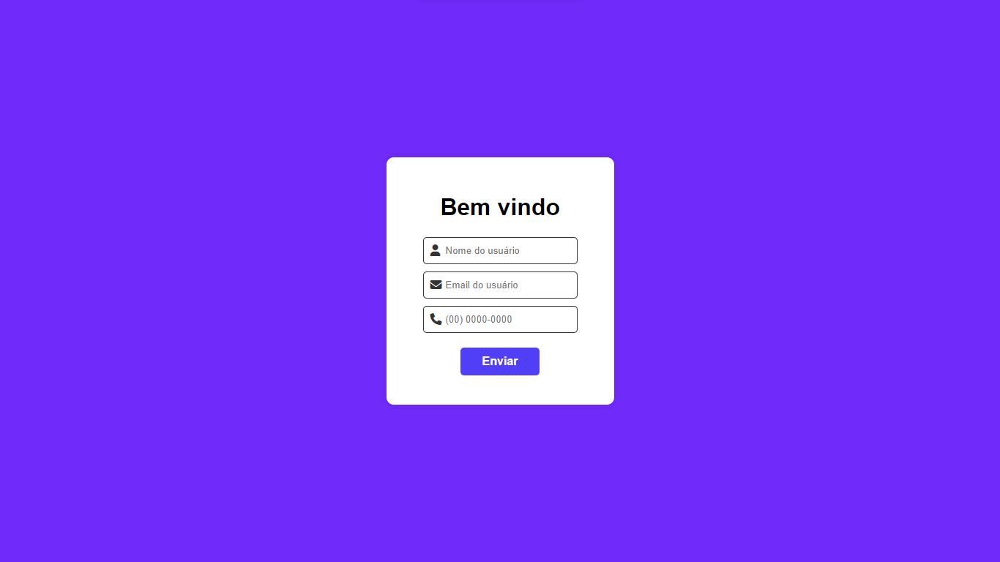

# Teste de Estagiário

Página criada como parte de um projeto de teste de estágio que contém um formulário de boas-vindas e uma mensagem de agradecimento após o envio do formulário.

## Visão Geral

A Página de Teste de Estagiário é um projeto web simples que demonstra a criação de um formulário de boas-vindas em HTML, estilizado com CSS, e com interações JavaScript. Após o envio do formulário, uma mensagem de agradecimento é exibida.

## Instruções de Uso

1. Acesse [https://vittorioaugusto.github.io/TesteEstagiario/](https://vittorioaugusto.github.io/TesteEstagiario/) em seu navegador.
2. Preencha o formulário com seu nome, e-mail e número de telefone.
3. Clique no botão "Enviar" para enviar o formulário.
4. Após o envio, uma mensagem de agradecimento será exibida na página.

## Tecnologias Utilizadas

- **HTML5:**
- **CSS3:**
- **JavaScript:**

## Autor

Vittorio Augusto Borges Cardoso Fernandes Maia.